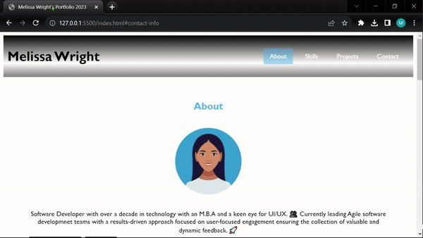

# Updated-M-Wright-Portfolio-2023
Updated professional portfolio. 

## Table of Contents 
-[AcceptanceCriteria](#acceptance_criteria)
-[DeployedSite](#deployed_site)
-[Screenshots](#Sreenshots)
-[Credits](#Credits)

## acceptance_criteria
Portfolio requirements include presenting the developer's name, recent photo, and navigation links to sections: about, work, and contact information. Clicking on navigation links smoothly scrolls to the corresponding sections. The "project" section displays titled images of the developer's applications, with the first image larger. Clicking on these images directs the user to the deployed applications. The portfolio must also exhibit a responsive layout, adapting to various screen sizes and devices.

## Deployed_Site 

https://mwrightvet.github.io/Updated-M-Wright-Portfolio-2023/ 

## PortfolioSections
🌟 About Me
🌟 Skills 
🌟 Linkedin Profile 
🌟 Projects
🌟 Contact Information 
 
## Screenshots  

## Credits 
Current Course Content from UCB Berkeley Full Stack Course
For Past Projects: My github 
For Past Projects: My project with a partner deployed on their Github https://github.com/magcox5/Project2-Pandemic
Websites: https://developer.mozilla.org/en-US/docs/Web/CSS/CSS_Flexible_Box_Layout/Basic_Concepts_of_Flexbox 
For Gallery: https://www.w3schools.com/csS/tryit.asp?filename=trycss_image_gallery_responsive
For Emojis:https://github.com/ikatyang/emoji-cheat-sheet/blob/master/README.md 
